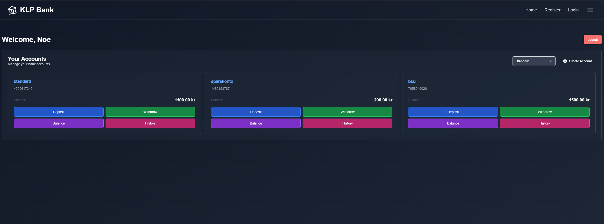

# 🏦 KLP Digital Bank - Interview Project

## 📝 Overview
A modern banking system prototype created for KLP's IT Developer Apprentice position. This web application allows users to:
- Create secure bank accounts
- Deposit/withdraw funds
- Check account balances
- View transaction history
- Manage multiple account types

## 🛠️ Technologies Used
- **Frontend**: React + TypeScript
- **Styling**: Tailwind CSS
- **Backend**: Node.js/Express
- **Database**: PostgreSQL

## 🚀 Getting Started

### Requirements
1. [Node.js](https://nodejs.org/) (v18+)
2. npm (comes with Node.js)
3. [PostgreSQL](https://www.postgresql.org/) (Version 10.0.22631.4890)
4. (Optional) pgAdmin 4

### Installation
```bash
# Clone repository
git clone https://github.com/DanielOM999/klp-digital-bank.git

# Install dependencies
cd frontend
npm i

# Build next frontend
npm run build

cd backend
npm i

# Start development server
npm run start
```
After installing, you also need to create a .env file in the backend folder. In the backend directory, create a file named .env with the following properties:

```env
SERVER_HOST=localhost
SERVER_PASSWORD= # your password
SERVER_DATABASE= # your database name
SERVER_LOGIN= # account to access the database in PostgreSQL
SERVER_PORT= # the port - default is 5432
SECRETKEY= # the secret key you want
```

## 📄 License
[](https://choosealicense.com/licenses/mit/)
---
*This project was created as part of KLP's IT Developer Apprentice recruitment process. Here is also a tekst i wrote to summerize my thought process, in norwegian*
---
[Opsumering av mine tanker under case oppgaven til KLP](Opsumering_av_mine_tanker_under_case_oppgaven_til_KLP.pdf)
